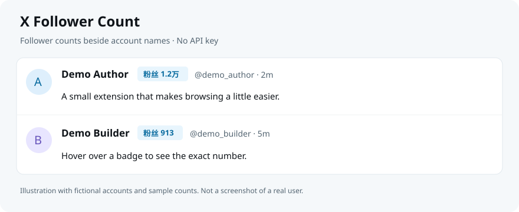

# X Follower Count · X 粉丝数

一个功能：在 X 常见页面的账号名字旁显示粉丝数，包括首页信息流、帖子与回复、引用帖、搜索结果、个人主页、关注列表和右侧推荐。

无需 API Key，无后台服务，无额外查询。数据来自当前页面已经收到的 X 响应。



## 安装到 Chrome

1. 从 [Releases](https://github.com/yiren-ai/x-follower-count/releases/latest) 下载 `x-follower-count-版本号.zip` 并解压；也可以下载项目源代码。
2. 在 Chrome 地址栏打开 `chrome://extensions`。
3. 打开右上角「开发者模式」，点击「加载已解压的扩展程序」。
4. 选择解压后的 `extension` 文件夹，里面应该能看到 `manifest.json`。
5. 刷新已经打开的 X 页面，打开首页或任意账号的关注者列表即可。

普通用户不需要运行服务器、安装 Node.js、注册服务或填写 API Key。当前通过 GitHub 分发，需要手动加载；尚未上架 Chrome Web Store。

## 使用

- 支持信息流作者、帖子详情和回复作者、引用帖作者、搜索账号/帖子、个人主页标题，以及页面中的账号卡片。
- 支持 `/<账号>/verified_followers`、`followers`、`following`、`followers_you_follow`。
- 名字旁显示「粉丝 913」「粉丝 10.5万」；鼠标停在标签上显示精确数字。
- 滚动加载、站内切换列表时自动更新，同时处理右侧推荐账号。
- 不给正文中每一个 @提及、只有头像的通知或非标准账号结构强行加标签；只有识别出明确账号且 X 返回了粉丝字段才能展示数字。
- 「粉丝 —」表示没有拿到数据，**不等于 0**。安装后先刷新页面。
- 数字来自 X 页面返回时的数据，不是持续实时推送。超过 30 分钟的页面缓存不再显示为有效数字；刷新可重新读取。

## 数据与权限

插件只在 `x.com` 和 `twitter.com` 运行，在本机处理页面已经返回的用户名和粉丝数。不发起额外查询，不调用 RapidAPI，没有服务器、统计上报或持久化存储。没有 Cookie、历史记录、标签页或存储权限。浏览器会提示它可以读取和更改 X 页面，这是添加标签所需的站点访问范围。

详细说明见 [PRIVACY.md](PRIVACY.md)。演示图使用虚构账号；测试只使用合成数据。

适配 2026-10-09 实测的新字段 `core.screen_name` / `relationship_counts.followers`，同时兼容旧的 `legacy.screen_name` / `legacy.followers_count`。X 更改页面结构或接口字段后可能需要更新插件。

## 开发与验证

```sh
npm ci
npm test
npm run package
```

运行时无第三方依赖；jsdom 仅用于本地测试。自动化用例覆盖账号映射、0 粉丝、精确数值、动态列表、DOM 复用、原帖/引用帖区分、站内路由、非法消息、fetch / XHR、晚启动重放和安装清单。

开发需要 Node.js 22+，打包需要 Python 3。安装包按白名单生成，只包含四个插件文件、安装说明、虚构账号示意图、许可证和隐私说明；SHA-256 校验值写入 `dist/SHA256SUMS.txt`。发布检查使用 `python3 -m unittest discover -s tests -p '*_test.py'` 验证安装包内容和可复现性。

`extension/` 为实际插件，`tests/` 为本地自动化测试。实际 Chrome 安装需要用户在扩展管理页完成。

## 已知限制

目前适配桌面版 Chrome 111 及以上版本。插件依赖 X 返回的数据与页面结构，无法保证所有实验界面都兼容。该项目与 X 官方没有隶属关系。

实现依据：Chrome 官方 [content scripts 文档](https://developer.chrome.com/docs/extensions/reference/manifest/content-scripts)，使用 Manifest V3 的 `document_start`、`MAIN` 和隔离执行环境。

## 反馈与许可证

欢迎通过 [Issues](https://github.com/yiren-ai/x-follower-count/issues) 提交复现步骤。请不要上传 Cookie、令牌、私信或其他私人数据。

本项目采用 [MIT License](LICENSE)。允许使用、修改和分发，请保留许可证与版权声明。
